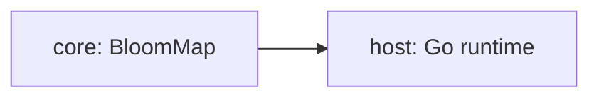

# Tradeoff analysis — Bloom filter pre-check in Go sync.Map miss latency

ATAM-lite, produced at P4. Method: `framework/instruments/atam-lite.md`.

## 1. Drivers

The concept must show a measurable miss-latency reduction over plain sync.Map under
read-heavy concurrent access (S-001). It must never return incorrect results — the Bloom
filter is a pre-check, not a replacement (S-002). It may exhibit higher latency than plain
sync.Map at low goroutine counts and at low miss rates, since the overhead has nothing to
avoid.

## 2. Architecture

| Mechanism | Carries which driver |
| :--- | :--- |
| Bloom filter `MayContain` pre-check before `sync.Map.Load` | S-001 — avoids the miss-path mutex |
| Two-layer design: filter is advisory, sync.Map is authoritative | S-002 — false positives degrade to plain sync.Map behaviour |
| Enhanced double hashing (Kirsch-Mitzenmacher) with maphash | S-001 — two hash calls simulate k independent hashes |

## 3. Approaches considered

| Approach | Chosen | Rejected alternative | Why |
| :--- | :--- | :--- | :--- |
| Bloom filter pre-check | ✔ | — | Directly proposed by Go issue #21035 as one of three contention-reduction directions |
| Sharded mutex map | | ✔ | Substitutes a different data structure rather than augmenting sync.Map; defeats the concept |
| Counting Bloom filter | | ✔ | Adds deletion support but doubles the bit-array size; simplicity is valued over delete at this scope |

## 4. Utility tree

Authoritative copy: `.sota/quality-gates.yaml`. Summary:

| ID | Characteristic | Priority | Difficulty |
| :--- | :--- | :--- | :--- |
| S-001 | performance-efficiency | high | high |
| S-002 | reliability | high | medium |
| S-003 | maintainability | medium | medium |

## 5. Analysis of high-priority scenarios

| Scenario | Mechanism that responds | Finding | ID |
| :--- | :--- | :--- | :--- |
| S-001 | Bloom `MayContain` avoids sync.Map miss path | The filter overhead trades against the miss-path savings; at low goroutine counts the overhead dominates | SP-001, SP-002 |
| S-002 | Bloom filter is advisory, sync.Map is authoritative | False positives from an overfilled filter degrade to plain sync.Map behaviour — correctness is preserved | SP-003 |

## 6. Adversarial pass

All five attacks are mandatory; attack 5 is the RDD check.

**A1 — Load.** At 10× designed volume (1,000,000 key insertions into a filter designed for
100,000), the false-positive rate climbs from 1% to ~60%, and the Bloom filter overhead
continues to be paid on every Load for no savings.
→ R-001: filter saturation under write-heavy workloads.

**A2 — Failure.** Kill the host (Go runtime crash). The Bloom filter is in-memory only — all
state is lost. On restart, the filter must be rebuilt from the sync.Map contents, which means
a full scan (O(n) Range()). The sync.Map survivor behaviour is unchanged.
→ R-002: no persistence; cold-start penalty.

**A3 — Change.** A new hash function is required (e.g., to address a performance regression or
hash-quality issue). Swapping `maphash` for an alternative affects exactly one file
(`src/bloom.go`), satisfying S-003.
→ NR-001: hash function swap is low-impact.

**A4 — Adversary.** An adversary who can choose keys designed to collide under the Bloom
filter's hash function can artificially inflate the false-positive rate. maphash seeds
are per-process random; the adversary cannot learn them from the Go runtime without a
separate disclosure. The window is per-process.
→ R-003: adversarial key-construction without seed disclosure is impractical.

**A5 — Substitution.** A competent engineer uses plain sync.Map with no Bloom filter. They
lose the miss-path avoidance — all absent-key Load() calls enter the mutex path under write
pressure. They gain no memory overhead, no insertion cost, and no false-positive complexity.
If the miss rate is below ~50% or the goroutine count is below ~4, the substitution is the
preferred choice. This concept exists to find where that stops being true.

## 7. Sensitivity points

| ID | Decision or parameter | Attribute it moves | Scenario |
| :--- | :--- | :--- | :--- |
| SP-001 | False-positive rate ε (bits per element m/n) | Miss-latency reduction: too high means lost savings; too low means wasted memory | S-001 |
| SP-002 | Goroutine count | Contention on sync.Map's internal mutex; the Bloom filter benefit is only visible under contention | S-001 |
| SP-003 | Miss rate (fraction of Load calls to absent keys) | Payback threshold: below ~50% miss rate, the filter overhead exceeds the miss-path savings | S-001 |

## 8. Tradeoff points

| ID | Decision | Improves | At the cost of | Chosen because |
| :--- | :--- | :--- | :--- | :--- |
| TP-001 | Bloom filter pre-check vs plain sync.Map | Miss-latency under high concurrency and high miss rate | Memory for bit array, per-insertion hash overhead, false-positive complexity | The Go team proposed this as an exploration direction (SRC-006) and it was never measured |

## 9. Risks and non-risks

| ID | Statement | Scenario | State | Mitigation / justification |
| :--- | :--- | :--- | :--- | :--- |
| R-001 | Filter saturates at insertion counts well beyond design capacity, making the pre-check pure overhead | S-001 | open | Resize or rebuild the filter periodically; not implemented at TRL 4 |
| R-002 | In-memory-only filter: restart requires O(n) rebuild from sync.Map Range() | S-002 | open | Documented limitation; the concept measures steady-state performance, not recovery |
| R-003 | Adversarial key construction could inflate false-positive rate | S-002 | open | Per-process random maphash seeds; the adversary must disclose the seed to construct collisions |
| NR-001 | Hash function swap is low-impact while the public interface (New/Add/MayContain) is stable | S-003 | — | Confirmed by D-001: affected surface is `src/bloom.go` only |

Every integration scoring IRL < 4 in `.sota/readiness.yaml` must appear here as an `R-###`
and be referenced by that integration's `risk_ref`.

## 10. Risk themes

| Theme | Risks | Driver endangered | Mitigation roadmap |
| :--- | :--- | :--- | :--- |
| Filter capacity management | R-001 | S-001 | Periodic FPR sampling + rebuild (not implemented; documented as drift_detection in R11) |
| State recovery | R-002 | S-002 | Explicit rebuild API; lower priority since concept measures steady-state |

